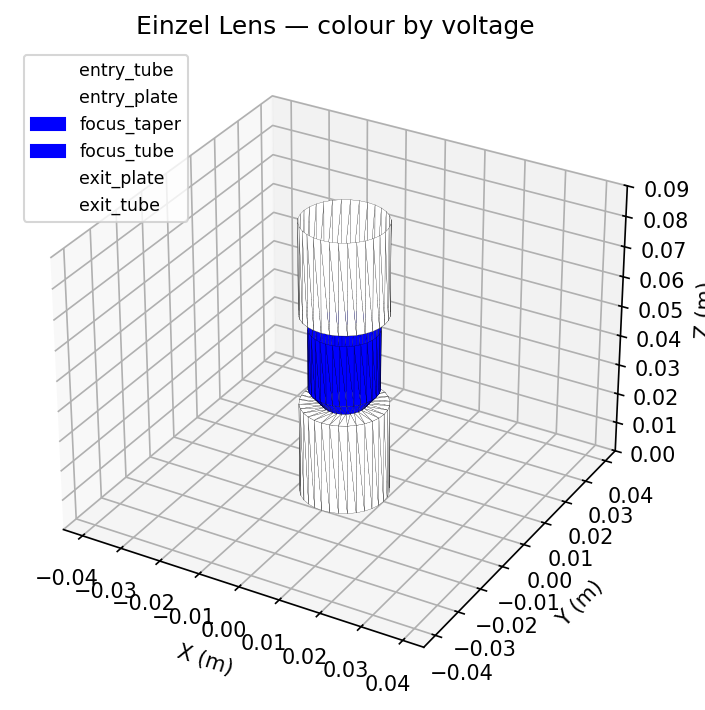
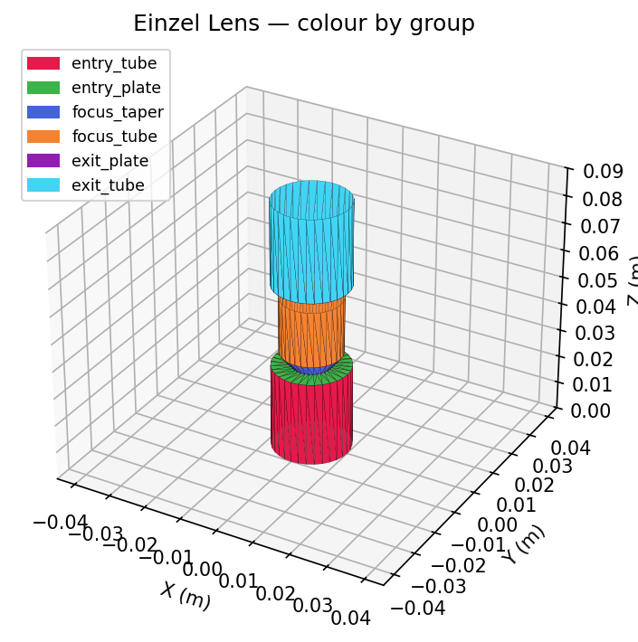

# IonForge

Open-source charged particle optics toolkit.

The SDK provides parametric geometry primitives for building simulation meshes, Pydantic v2 serialization models, STL mesh import/export with quality metrics, and JSON Schema generation for TypeScript codegen.

## Installation

```bash
uv add ionforge
```

## Quick Start

```python
from ionforge.geometry import Geometry, Cylinder, AnnularDisk

geo = Geometry(bounding_box=(0.1, 0.1, 0.2))

geo.add(Cylinder(r=0.01, length=0.05, voltage=100, name="tube_1"))
geo.add(AnnularDisk(inner_radius=0.005, outer_radius=0.01, voltage=0, name="aperture"), z=0.06)
geo.add(Cylinder(r=0.01, length=0.05, voltage=50, name="tube_2"), z=0.07)

serialized = geo.to_serialized_geometry()
errors = serialized.validate_consistency()  # [] if valid
```

## Examples

Runnable scripts are in the [`examples/`](examples/) directory. Run any of them with:

```bash
uv run python examples/<name>.py
```

### Parametric primitives

Build geometry using `Cylinder`, `AnnularDisk`, `Cone`, and `Sphere` primitives. Each primitive takes a `voltage`, `name`, and `n_segments` (default 32) for mesh resolution.

```python
from ionforge.geometry import Geometry, Cylinder, AnnularDisk, Cone, Sphere

geo = Geometry(bounding_box=(0.1, 0.1, 0.3))

# Drift tube
geo.add(Cylinder(r=0.01, length=0.05, voltage=100, name="tube_1"))

# Aperture plate
geo.add(
    AnnularDisk(inner_radius=0.003, outer_radius=0.01, voltage=0, name="aperture"),
    z=0.06,
)

# Tapered section
geo.add(
    Cone(bottom_radius=0.01, top_radius=0.005, length=0.03, voltage=-50, name="taper"),
    z=0.07,
)

# Second tube
geo.add(Cylinder(r=0.005, length=0.05, voltage=100, name="tube_2"), z=0.10)

serialized = geo.to_serialized_geometry()
```

See [`examples/build_geometry.py`](examples/build_geometry.py) for a full runnable version.

### STL import and export

Load a mesh from an STL file, inspect quality metrics, and re-export.

```python
from ionforge.geometry.stl_import import load_stl, mesh_stats, write_stl

# Load STL with mm -> metres conversion
triangles = load_stl("model.stl", scale_factor=1e-3)

# Print mesh quality statistics
stats = mesh_stats(triangles, verbose=True)
# Mesh statistics:
#   Triangles: 2  (0 degenerate, 2 valid)
#   Total area: 500.00 mm²
#   Edge range: 0.707 – 1.000 mm
#   Aspect ratio: mean=1.41  max=1.41

# Export as binary STL
write_stl("output.stl", triangles, name="my_mesh")
```

See [`examples/stl_round_trip.py`](examples/stl_round_trip.py) for a self-contained runnable version.

### Visualization

Geometry can be rendered in 3-D with three backends: **matplotlib** (default, no extra deps), **plotly** (interactive, great for Jupyter/Colab), and **pyvista** (full VTK).

```python
geo = Geometry(bounding_box=(0.06, 0.06, 0.12))
geo.add(Cylinder(r=0.01, length=0.03, voltage=0, name="tube"))
# ... build geometry ...

geo.visualize()                          # matplotlib (default)
geo.visualize(backend="plotly")          # interactive HTML widget
geo.visualize(backend="pyvista")         # VTK 3-D window
```

Color by group name or by voltage (auto-selected when every group has a voltage):

```python
geo.visualize(color_by="voltage")        # blue–white–red diverging colourmap
geo.visualize(color_by="group")          # per-group hex colours
```

| Colour by voltage | Colour by group |
|---|---|
|  |  |

You can also render a `SerializedGeometry` directly:

```python
from ionforge.geometry.visualization import render

render(serialized, backend="plotly", color_by="voltage", opacity=0.8)
```

Install optional visualization backends:

```bash
uv add ionforge --extra viz-plotly    # plotly only
uv add ionforge --extra viz-pyvista   # pyvista only
uv add ionforge --extra viz           # all visualization deps
```

Per-backend examples:

- [`examples/viz_matplotlib.py`](examples/viz_matplotlib.py) — static 3-D plot (no extra deps)
- [`examples/viz_plotly.py`](examples/viz_plotly.py) — interactive HTML widget
- [`examples/viz_pyvista.py`](examples/viz_pyvista.py) — full VTK 3-D window

See also [`examples/visualize_geometry.py`](examples/visualize_geometry.py) for a CLI version with `--backend` and `--color-by` flags.

### JSON round-trip

Geometry models use snake_case in Python and camelCase when serialized to JSON. Both naming conventions are accepted when parsing.

```python
import json
from ionforge.geometry import SerializedGeometry

# Serialize to camelCase JSON
camel_json = json.dumps(serialized.model_dump(by_alias=True), indent=2)
# {"version": 1, "units": "m", "boundingBox": {...}, "groupOrder": [...], ...}

# Parse from camelCase
parsed = SerializedGeometry.model_validate_json(camel_json)

# Parse from snake_case (also works)
parsed = SerializedGeometry.model_validate({
    "version": 1,
    "units": "m",
    "vertices": [],
    "edges": [],
    "faces": [],
    "bounding_box": {"size": [1, 1, 1], "voltage": 0},
    "groups": [],
    "group_order": [],
})
```

See [`examples/json_round_trip.py`](examples/json_round_trip.py) for the full runnable version.

### JSON Schema generation

Generate a JSON Schema from the Pydantic models, useful for TypeScript codegen with tools like `json-schema-to-zod`:

```bash
python -m ionforge.geometry.export_schema > geometry-schema.json
```

Then generate TypeScript types:

```bash
npx json-schema-to-zod -i geometry-schema.json -o geometry.generated.ts
```

See [`examples/export_schema.py`](examples/export_schema.py) for the programmatic version.

### Low-level model API

For full control, construct `SerializedGeometry` directly from vertices, edges, faces, and groups:

```python
from ionforge.geometry import (
    BoundingBox, Edge, Face, Group, SerializedGeometry, Vertex,
)

geo = SerializedGeometry(
    vertices=[
        Vertex(id="v0", position=(0.0, 0.0, 0.0)),
        Vertex(id="v1", position=(0.1, 0.0, 0.0)),
        Vertex(id="v2", position=(0.05, 0.1, 0.0)),
    ],
    edges=[
        Edge(id="e0", v0="v0", v1="v1", face_ids=["f0"]),
        Edge(id="e1", v0="v1", v1="v2", face_ids=["f0"]),
        Edge(id="e2", v0="v2", v1="v0", face_ids=["f0"]),
    ],
    faces=[
        Face(id="f0", vertex_ids=["v0", "v1", "v2"], edge_ids=["e0", "e1", "e2"]),
    ],
    bounding_box=BoundingBox(size=(0.2, 0.2, 0.2), voltage=0.0),
    groups=[
        Group(id="g0", name="plate", color="#ff0000", voltage=10.0, face_ids=["f0"]),
    ],
    group_order=["g0"],
)

errors = geo.validate_consistency()  # [] if valid
```

## Development

```bash
uv sync --extra dev
uv run pytest
uv run ruff check .
uv run ty check
```
